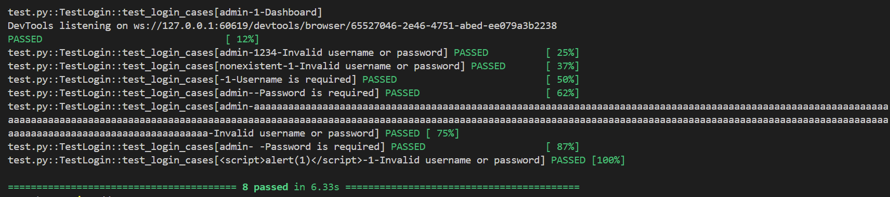

# Selenium Test Report for Flask Login

## 1. Mục đích

Bài kiểm tra này nhằm kiểm tra chức năng đăng nhập của ứng dụng Flask. Mục tiêu là xác minh rằng hệ thống xử lý đúng các tình huống đăng nhập hợp lệ và không hợp lệ, bao gồm thông báo lỗi khi tên đăng nhập hoặc mật khẩu sai.

## 2. Môi Trường

- **Ứng dụng**: Flask (chạy trên `http://127.0.0.1:5000/`)
- **Trình duyệt**: Google Chrome (phiên bản tương thích với Selenium WebDriver)
- **Selenium**: Sử dụng Selenium WebDriver để tự động hóa việc kiểm tra
- **Hệ điều hành**: (Đưa hệ điều hành bạn sử dụng vào đây, ví dụ: Ubuntu 20.04)

## 3. Các Bước Thực Hiện

### 3.1 Mở Trình Duyệt và Truy Cập Ứng Dụng
- Mở trang chủ của ứng dụng Flask tại `http://127.0.0.1:5000/`.

### 3.2 Đăng Nhập với Tên Đăng Nhập và Mật Khẩu Sai
- Nhập tên đăng nhập: `admin` vào ô `username`.
- Nhập mật khẩu sai: `123` vào ô `password`.
- Nhấn nút "Đăng Nhập".
- Kiểm tra xem có chuyển hướng đến trang dashboard không (mong đợi ứng dụng sẽ không cho phép đăng nhập và hiển thị thông báo lỗi).

### 3.3 Đăng Nhập với Mật Khẩu Đúng
- Nhập mật khẩu đúng: `1234`.
- Nhấn nút "Đăng Nhập" một lần nữa.
- Kiểm tra xem trang có chuyển hướng đến trang `dashboard` không (mong đợi việc đăng nhập thành công và chuyển hướng đến trang dashboard).

## 4. Kết Quả Mong Đợi

1. Khi nhập mật khẩu sai (`123`), ứng dụng sẽ không cho phép đăng nhập và hiển thị thông báo lỗi "Tên đăng nhập hoặc mật khẩu không đúng!".
2. Khi nhập mật khẩu đúng (`1234`), ứng dụng sẽ chuyển hướng người dùng đến trang `dashboard`.

## 5. Kết Quả Thực Tế

1. **Đăng nhập với mật khẩu sai**:
   - Sau khi nhập mật khẩu sai, ứng dụng không chuyển hướng tới trang dashboard mà hiển thị thông báo lỗi, như mong đợi.

2. **Đăng nhập với mật khẩu đúng**:
   - Sau khi nhập mật khẩu đúng, ứng dụng chuyển hướng thành công đến trang dashboard, xác nhận việc đăng nhập thành công.

## 6. Kết Luận

- Bài kiểm tra này xác nhận rằng chức năng đăng nhập hoạt động đúng như mong đợi. Các trường hợp đăng nhập thành công và thất bại đều được xử lý chính xác.
- Không phát hiện vấn đề nào trong quá trình kiểm tra. Tuy nhiên, một số cải tiến có thể được thực hiện để nâng cao tính ổn định và trải nghiệm người dùng.

## 7. Cải Tiến

- **Kiểm tra chi tiết hơn**: Có thể kiểm tra tính toàn vẹn của các phần tử trên trang `dashboard` sau khi đăng nhập thành công.
- **Thông báo lỗi**: Nên cải thiện cách thông báo lỗi để dễ dàng nhận biết khi nào tên đăng nhập hoặc mật khẩu không đúng.
- **Hỗ trợ giao diện động**: Kiểm tra giao diện khi có sự thay đổi về các phần tử, chẳng hạn như hộp thoại thông báo lỗi.

## 8. Cách Chạy Bài Test

1. Cài đặt môi trường Python (nếu chưa cài):

    ```bash
    pip install selenium
    ```

2. Cài đặt WebDriver cho Chrome (hoặc trình duyệt bạn sử dụng).

3. Chạy bài test:

    ```bash
    pytest test_login.py
    ```
4. Kết quả



## 9. Tài Liệu Tham Khảo

- [Selenium Documentation](https://www.selenium.dev/documentation/en/)
- [Pytest Documentation](https://docs.pytest.org/en/stable/)
